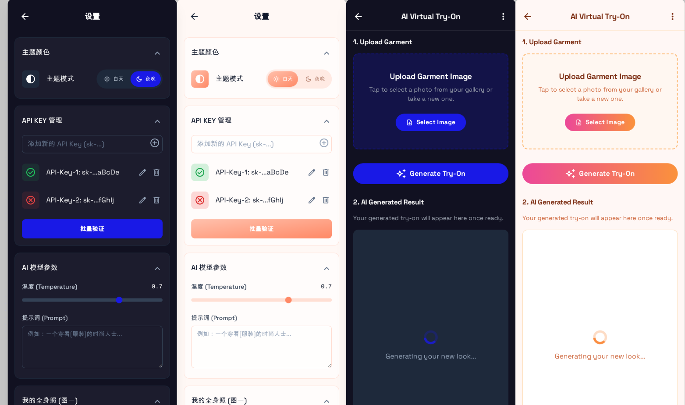

# AI 虚拟试衣间 (AI Virtual Try-On)

> 一款完全运行在浏览器中的纯前端 AI 虚拟换装应用。支持多种 AI 服务提供商，包括 Google AI Studio 和 Grsai (nano banana 模型)，实现将任意服装图片"穿"在用户指定的模特照片上。本项目注重隐私和易用性，所有敏感信息（如 API Key 和个人照片）均存储在用户本地。


*(注：上图为项目的设计效果图)*

---

## ✨ 项目简介

AI 虚拟试衣间是一个轻量级的移动端 Web 应用，旨在提供一个简单、快速的 AI 换装体验。与需要后端服务器和复杂部署的传统应用不同，本项目采用纯前端技术栈实现，这意味着：

*   **高隐私性:** 用户的 API Key 和个人照片仅保存在浏览器的 `localStorage` 中，绝不会上传到任何服务器。
*   **零后端成本:** 无需服务器、数据库或云函数，可以直接部署在任何静态网站托管平台（如 GitHub Pages, Vercel, Netlify）。
*   **双AI提供商支持:** 支持 Google AI Studio 和 Grsai (nano banana) 两种API，用户可根据需求选择最适合的服务。
*   **真实图片生成:** 通过 Grsai 的 nano banana 模型实现真正的图像生成，提供更逼真的试穿效果。
*   **易于部署和修改:** 整个项目由 HTML, CSS (Tailwind) 和原生 JavaScript构成，代码结构清晰，易于二次开发。

## 🚀 主要功能

*   **服装上传:** 支持用户从手机相册选择或拍摄服装照片，并自动进行压缩和预处理。
*   **模特照设置:** 在设置页面预先上传一张全身照作为换装的基底模特，无需每次生成都重复上传。
*   **双AI提供商生成:** 一键调用 AI 模型，支持 Google AI Studio 和 Grsai 两种服务，将服装"穿"在模特身上，并展示生成结果。
*   **结果处理:** 支持将生成的图片**保存**到本地相册，或通过系统原生分享功能**分享**给朋友。
*   **页面导航系统:**
    *   主页面右上角的设置按钮，可快速访问设置页面
    *   设置页面左上角的返回按钮，可便捷回到主页面
    *   双向导航设计，提供流畅的用户体验
*   **API 提供商管理:**
    *   支持 **Google AI Studio** 和 **Grsai** 两种服务提供商切换。
    *   Google AI：支持添加**多个** API Key，自动进行**轮询**，以最大化利用免费额度。
    *   Grsai：支持 nano banana 模型，提供真实的图像生成能力。
    *   提供**批量验证**功能，直观显示每个 Key 的有效状态。
*   **AI 参数自定义:**
    *   可调节模型的**温度 (Temperature)** 参数，以控制生成结果的创造性。
    *   支持自定义**提示词 (Prompt)**，为 AI 提供更精确的生成指导。
    *   提示词支持 `[服装]` 占位符，系统会自动替换为具体服装描述。
*   **改进的用户界面:**
    *   优化的按钮设计，包含悬停效果和过渡动画
    *   Toast 通知系统，提供实时的操作反馈
    *   详细的加载状态指示器，让用户了解处理进度
    *   响应式设计，完美适配移动端和桌面端
*   **数据持久化:** 所有设置（API Keys, AI 参数, 模特照片、提供商选择）都会自动保存在本地，关闭浏览器后依然存在。

## 🛠️ 技术栈

*   **前端框架:** 无。使用 **原生 JavaScript (ES6 模块化)** 构建，以保持项目的轻量和纯粹。
*   **样式方案:** **Tailwind CSS**，通过 CDN 引入，用于快速构建与设计稿一致的响应式界面。
*   **数据存储:** 浏览器 **`localStorage`**，用于持久化用户的所有设置。
*   **AI 服务提供商:**
    *   **Google AI Studio (Gemini 1.5 Flash)**：多模态理解模型，支持图片和文本输入
    *   **Grsai (nano-banana-fast)**：专业的图像生成模型，提供逼真的虚拟试穿效果
*   **架构设计:** 模块化服务层抽象，支持无缝切换不同的AI提供商

## 🏃‍♂️ 如何开始

本项目无需复杂的构建步骤，可以直接在浏览器中运行。

1.  **克隆仓库**
    ```bash
    git clone https://github.com/your-username/ai-virtual-try-on.git
    ```

2.  **本地运行**
    *   进入项目目录 `cd ai-virtual-try-on`。
    *   由于项目使用了 ES 模块，直接用 `file://` 协议打开 HTML 文件可能会遇到 CORS 策略问题。推荐使用一个简单的本地服务器来运行：
        *   如果你安装了 VS Code，可以安装 [Live Server](https://marketplace.visualstudio.com/items?itemName=ritwickdey.LiveServer) 插件，右键点击 `index.html` 或 `settings.html` 选择 "Open with Live Server"。
        *   或者使用 Python 的简易服务器：`python -m http.server`，然后在浏览器中访问 `http://localhost:8000`。

3.  **配置应用**
    *   打开浏览器，访问 `index.html` 主页面。
    *   点击右上角的 **设置按钮** (⚙️) 导航到设置页面。
    *   在 "API 提供商" 部分，选择你想要使用的 AI 服务：
        *   **Google AI Studio**: 适合理解和分析任务，需要从 [Google AI Studio](https://aistudio.google.com/app/apikey) 获取 API Key
        *   **Grsai**: 专业的图像生成服务，提供更逼真的试穿效果，需要联系服务方获取 API Key
    *   根据选择的提供商，添加相应的 API Key（Google AI 支持添加多个 Key 进行轮询）。
    *   在 "我的全身照" 部分，上传一张你想要作为模特的清晰全身照。
    *   （可选）根据需要调整 "AI 模型参数"：
        *   **温度**: 控制生成结果的创造性（0-1）
        *   **提示词**: 自定义生成指导，支持 `[服装]` 占位符
    *   配置完成后，点击左上角的 **返回按钮** (←) 回到主页面。

4.  **开始使用**
    *   在主页面中，上传一件服装的图片。
    *   点击 "Generate Try-On" 按钮，等待 AI 生成结果！
    *   生成完成后，可以保存或分享结果图片。

> 💡 **导航提示**: 在使用过程中，您可以随时通过右上角的设置按钮调整配置，通过设置页面的返回按钮回到主界面。
>
> 💡 **提供商选择建议**:
> - 如需**理解分析**任务，选择 **Google AI Studio**
> - 如需**真实图像生成**，选择 **Grsai**

## 🎨 用户界面和导航

本项目注重用户体验，提供了直观且流畅的界面设计和导航系统。

### 导航流程
*   **主页面 → 设置页面**: 点击右上角的设置图标 (⚙️)
*   **设置页面 → 主页面**: 点击左上角的返回图标 (←)
*   双向导航设计，确保用户可以轻松在不同功能间切换

### 界面特性
*   **响应式设计**: 完美适配手机、平板和桌面设备
*   **Material Design 图标**: 使用 Google Material Icons 提供清晰的视觉指引
*   **悬停效果**: 所有可交互元素都有精心设计的悬停状态
*   **过渡动画**: 流畅的页面切换和状态变化动画

### 用户反馈系统
*   **Toast 通知**: 重要操作的成功/失败反馈
*   **加载指示器**: AI 生成过程中的进度提示
*   **状态管理**: 按钮禁用/启用状态，防止重复操作

### 主题支持
*   **亮色主题**: 默认的温暖色调设计
*   **深色模式**: （规划中）为夜间使用提供护眼模式
*   **自适应配色**: 基于橙色和粉色的温暖配色方案

## 📂 项目结构

项目的代码结构清晰且模块化，易于理解和维护。

```
/
├── index.html              # 主界面 (生成界面)，包含设置导航按钮
├── settings.html           # 设置界面，包含返回导航按钮
├── test-api.html           # API 测试页面，用于调试接口
├── README.md               # 项目文档
├── favicon.ico            # 网站图标
├── showPoto/              # 示例图片目录
│   └── show.png          # 应用效果图
└── /assets/
    ├── /css/
    │   └── style.css     # 自定义样式文件
    └── /js/
        ├── /services/
        │   ├── storage.service.js    # 本地存储服务，管理数据读写
        │   └── api.service.js        # API 调度服务，统一管理不同提供商
        ├── /providers/
        │   ├── google.provider.js    # Google AI 提供商实现
        │   └── grsai.provider.js     # Grsai 提供商实现
        ├── /utils/
        │   ├── dom.util.js           # DOM 操作工具，如 Toast 提示
        │   └── image.util.js         # 图片处理工具，校验、压缩、转换
        ├── settings.js               # 设置页面主逻辑脚本
        └── generator.js              # 生成页面主逻辑脚本
```

### 架构设计亮点
*   **提供商抽象**: 通过 `providers` 目录实现不同 AI 服务的统一接口
*   **服务层分离**: API 调度和存储服务独立，便于测试和维护
*   **模块化结构**: 每个功能模块独立，支持按需加载
*   **工具函数复用**: 通用功能封装在 utils 目录中

### 导航实现架构
*   **事件驱动设计**: 使用原生 JavaScript 事件监听器处理按钮点击
*   **页面级路由**: 通过 `window.location.href` 实现简单的页面跳转
*   **状态保持**: 每个页面独立管理其状态，通过 localStorage 实现跨页面数据持久化
*   **模块化结构**: 导航逻辑分别封装在对应的页面脚本中，便于维护

## ⚠️ 重要提示：关于 AI 提供商

本项目现在支持**两种不同的 AI 服务提供商**，各有其特点和适用场景：

### 🤖 Google AI Studio (Gemini 1.5 Flash)
*   **模型类型**: 多模态**理解**模型
*   **能力**: 可以识别和分析图片内容，主要输出为**文本**描述
*   **限制**: **不具备直接生成新图片**的能力
*   **适用场景**: 服装分析、风格描述、内容理解
*   **状态**: 当前实现中的 Google API 调用部分主要作为架构示例

### 🎨 Grsai (nano-banana-fast)
*   **模型类型**: 专业的**图像生成**模型
*   **能力**: 真正的 Image-to-Image 生成，可将服装"穿"到模特身上
*   **优势**: 提供逼真的虚拟试穿效果
*   **API 特点**: 支持异步任务处理，需要轮询获取结果
*   **状态**: **推荐使用**，能够实现项目的核心功能

### 🔧 技术实现说明
*   **抽象架构**: 项目通过 `providers` 目录实现了统一的 API 接口
*   **无缝切换**: 用户可以在设置页面自由选择合适的提供商
*   **错误处理**: 每个提供商都有独立的错误处理和重试机制
*   **响应格式**: 系统自动处理不同提供商的响应格式差异

### 💡 使用建议
*   **图像生成需求**: 选择 **Grsai** 提供商
*   **分析理解需求**: 选择 **Google AI Studio** 提供商
*   **测试和开发**: 可以在两个提供商之间切换测试效果

## ⚠️ 当前已知问题与解决方案

### 🐛 已发现的技术问题

#### 1. Grsai 模特照片传递问题
*   **问题位置**: [`grsai.provider.js:42-47`](assets/js/providers/grsai.provider.js#L42-L47)
*   **问题描述**: 当前实现中，用户上传的模特照片并未传递给 Grsai API
*   **影响**: 生成结果可能缺少用户个人特征，效果不够个性化
*   **临时解决方案**: 代码中已注释相关部分，需要实现图片上传机制或转换 Base64 为 URL

#### 2. 图片展示适配问题
*   **问题位置**: [`index.html:90`](index.html#L90)
*   **问题描述**: 结果容器使用固定的 2:3 宽高比，可能导致生成的图片被裁剪或显示不全
*   **影响**: 用户可能看不到完整的人像，特别是头部和肩部区域
*   **临时解决方案**: 调整 CSS 容器比例或使用 `object-cover` 替代 `object-contain`

#### 3. API 响应格式不统一
*   **问题位置**: [`api.service.js`](assets/js/services/api.service.js)
*   **问题描述**: Google 返回 Base64，Grsai 返回 URL，处理逻辑不一致
*   **影响**: 可能导致某些情况下的显示或下载问题
*   **临时解决方案**: 在服务层统一转换为相同格式

#### 4. 错误处理不够完善
*   **问题位置**: 各个 provider 文件
*   **问题描述**: 部分网络错误和 API 错误的处理不够友好
*   **影响**: 用户体验可能不够流畅，错误信息不够明确
*   **临时解决方案**: 添加更详细的错误日志和用户提示

### 🔧 建议的修复优先级

1. **高优先级**: 修复 Grsai 模特照片传递问题
2. **中优先级**: 优化图片展示适配机制
3. **中优先级**: 统一 API 响应格式处理
4. **低优先级**: 完善错误处理和用户提示

### 💻 开发者注意事项
*   在进行修改时，请确保同时更新两个提供商的实现
*   建议添加单元测试来验证 API 调用逻辑
*   考虑添加用户反馈机制，收集问题报告

## 🌟 未来展望

### ✅ 已完成功能
*   [x] **实现页面导航系统**，在主页面和设置页面之间无缝切换
*   [x] **改进按钮交互设计**，提供更好的用户反馈和悬停效果
*   [x] **优化移动端体验**，确保响应式设计和流畅的操作
*   [x] **集成 Grsai API**，实现真正的图像生成功能
*   [x] **双提供商支持**，支持 Google AI Studio 和 Grsai 切换
*   [x] **模块化架构重构**，实现可扩展的提供商抽象层
*   [x] **API Key 管理**，支持多 Key 轮询和状态管理

### 🚧 当前开发计划
*   [ ] **修复 Grsai 模特照片传递问题**，确保个性化生成效果
*   [ ] **优化图片展示适配机制**，解决裁剪和显示不全问题
*   [ ] **统一 API 响应格式处理**，提供一致的用户体验
*   [ ] **完善错误处理机制**，提供更友好的错误提示

### 🎯 中长期规划
*   [ ] **实现深色模式 (Dark Mode)**，并提供主题切换功能
*   [ ] **生成历史记录**，允许用户查看和管理之前生成的图片
*   [ ] **更丰富的编辑功能**，如调整服装位置、选择生成风格等
*   [ ] **批量服装处理**，支持一次性上传多件服装进行批量生成
*   [ ] **用户偏好学习**，根据用户的历史选择优化 AI 参数设置
*   [ ] **本地优先策略**，性能优化，计划结合 PWA 进行 Web 应用化
*   [ ] **多语言支持**，添加英文、日文等国际化支持
*   [ ] **社区分享功能**，允许用户分享和下载优秀的生成结果

### 🔧 技术债务清理
*   [ ] **添加单元测试**，确保代码质量和稳定性
*   [ ] **性能优化**，减少图片处理时间和内存占用
*   [ ] **代码重构**，进一步模块化和解耦
*   [ ] **文档完善**，添加 API 文档和开发者指南
*   [ ] **安全性提升**，加强 API Key 和用户数据保护
## 📄 许可证 (License)

本项目采用 [MIT](https://opensource.org/licenses/MIT) 许可证。